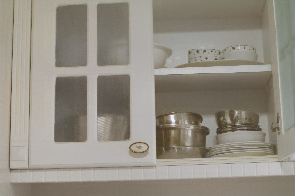
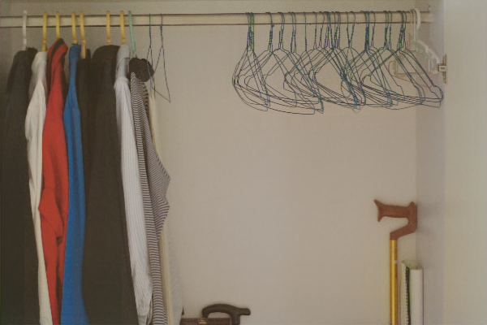

## Representative Color Transform for Image Enhancement
This is a PyTorch implementation of RCTNet. 

```
@InProceedings{Kim_2021_ICCV,
author    = {Kim, Hanul and Choi, Su-Min and Kim, Chang-Su and Koh, Yeong Jun},
title     = {Representative Color Transform for Image Enhancement},
booktitle = {Proceedings of the IEEE/CVF International Conference on Computer Vision (ICCV)},
month     = {October},
year      = {2021},
pages     = {4459-4468}
}
```
[[Paper]](https://openaccess.thecvf.com/content/ICCV2021/html/Kim_Representative_Color_Transform_for_Image_Enhancement_ICCV_2021_paper.html)
[[Slide(unofficial, in Chinese)]](https://docs.google.com/presentation/d/1wM1X7p1j7lD0r9HvR9o_JiLuRG12G-GU/edit?usp=sharing&ouid=114646893705937803496&rtpof=true&sd=true)


### Develop Environment
OS: Windows10

GPU: Nvidia TITAN V

```pip install -r requirement.txt```

### Train
The original LOL dataset can be downloaded from [here](https://daooshee.github.io/BMVC2018website/).  
```python -m visdom.server -port=8097```</br>
```python scripts/script.py --train```

### Predict
```python -m visdom.server -port=8097```</br>
```python scripts/script.py --predict```

### Evaluation on LOL Dataset





### Structure of Project Folder
```
$ tree
.
├─ablation
├─checkpoints
│  ├─rctnet_FiveK_batch8
│  └─rctnet_LoL_batch8
├─datasets
│  ├─LoL
│  │  ├─eval
│  │  │  ├─dataA
│  │  │  └─dataB
│  │  └─train
│  │     ├─dataA
│  │     └─dataB
│  └─MIT-Adobe5K
│     ├─eval
│     │  ├─dataA
│     │  └─dataB
│     └─train
│        ├─dataA
│        └─dataB
├─models
├─scripts
└─utils
```
